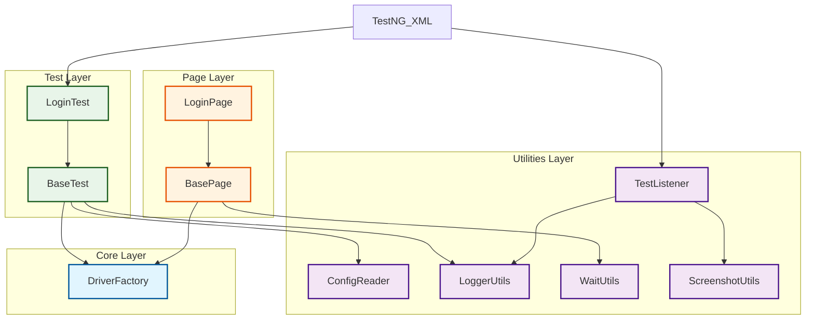

# 🚀 Salesforce Automation Framework


> **An enterprise-grade, scalable test automation framework for Salesforce.**
> Built with a focus on modularity, thread-safety, and maintainability using the Page Object Model (POM) design pattern.

---

## 🏗️ Architecture Design

The framework leverages a **Layered Architecture** to decouple test logic from implementation details.



---

## 📂 Project Structure

Verified, standardized directory layout ensuring separation of concerns.

| Directory | Package | Description |
|-----------|---------|-------------|
| 🛣️ `driver` | `com.salesforce.driver` | **DriverFactory**: Thread-safe (ThreadLocal) WebDriver management. |
| 🧱 `base` | `com.salesforce.base` | **BasePage**: Wraps Selenium actions.<br>**BaseTest**: Manages test lifecycle (setup/teardown). |
| 📄 `pages` | `com.salesforce.pages` | **Page Objects**: Contains locators and page-specific logic (e.g., `LoginPage`). |
| 🛠️ `utils` | `com.salesforce.utils` | **ConfigReader**: Enivronment properties loader.<br>**ExtentReportManager**: Timestamped report generation.<br>**WaitUtils**: Explicit wait helpers.<br>**LoggerUtils**: Log4j2 wrapper.<br>**ScreenshotUtils**: Failure capture. |
| 🧪 `tests` | `com.salesforce.tests` | **Test Classes**: Actual TestNG test scenarios. |
| ⚙️ `resources`| `src/main/resources` | **Config**: `qa.properties`, `uat.properties`...<br>**Suites**: `testng.xml`. |

---

## ⚡ Key Features

- **🧵 Parallel Execution**: Usage of `ThreadLocal<WebDriver>` ensures safe parallel test execution across multiple threads.
- **🌍 Multi-Environment Support**: Seamlessly switch between **QA**, **UAT**, and **PROD** by changing a single flag.
- **🛡️ Robust Synchronization**: No basic `Thread.sleep()`. All interactions use `WaitUtils` for reliable explicit waits.
- **📊 Rich Reporting**: Integrated **ExtentReports** with automatic screenshot attachment on failure.
- **🕒 Preservation**: Reports are saved in timestamped folders (e.g., `reports/2026-02-02_23-00-00/`) to prevent overwriting history.
- **📝 Detailed Logging**: Context-aware logging using Log4j2 for easier debugging.

---

## 🚀 How to Run

### 1️⃣ Default Run (QA Environment)
Executes all tests specified in `testng.xml` against the QA environment.
```bash
mvn clean test
```

### 2️⃣ Environment Specific Run
Run tests against a specific environment (e.g., UAT or PROD).
```bash
mvn clean test -Denv=uat
# or
mvn clean test -Denv=prod
```

### 3️⃣ View Reports
After execution, robust HTML reports are generated in a timestamped folder:
- 📂 **Path**: `reports/yyyy-MM-dd_HH-mm-ss/TestExecutionReport_....html`

---

## 🛠️ Technology Stack

- **Language**: Java 16+
- **Web Automation**: Selenium WebDriver 4.40.0
- **Test Runner**: TestNG 7.12.0
- **Build Tool**: Maven
- **Reporting**: ExtentReports 5.1.1
- **Logging**: Log4j2
